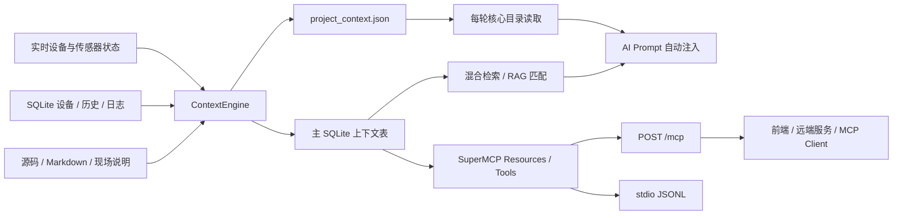

# A9 超级上下文 / RAG / MCP 前后端完整对齐文档

版本：1.0.0  
日期：2026-07-17  
目标设备：`d6290341334135353210f41a68f0bb00`  
设备后端：`/data/A9/smart_home`  
桌面源码：`C:\Users\xyls\Desktop\A9_backend_upgrade`  
协议：MCP `2025-11-25`  

> 本文是前端、远端服务端、AI 编排层和 MCP 客户端的实现对齐基线。示例中的 `<A9_IP>`、`<API_KEY>`、`<TOKEN>` 都是占位符，禁止把真实值提交到源码。

## 1. 已上线能力

本次升级已在 A9 设备运行：

1. 将 Python 源码符号、Markdown 文档、设备、传感器、场景、API、能力、联动规则、实时状态、操作历史和运行日志统一收集到主 SQLite。
2. 原子生成 `/data/A9/smart_home/project_context.json`。
3. 每次非纯开场问候的 AI 对话都会读取 JSON 核心目录、匹配数据库/RAG/历史记录，并注入最多 48,000 字符上下文。
4. 提供 MCP Streamable HTTP 和 stdio 两个入口，共用同一个协议、资源、工具、校验、权限和审计实现。
5. 新设备注册后立即进入 `device_registry`、上下文实体、JSON、RAG、设备列表和通用控制工具。
6. 新能力可注册并通过 `invoke_capability` 调用，但执行器严格限制在安全白名单。
7. 毫米波人体存在开关已启用，并与雷达自动开灯联动开关分离。
8. 门禁 open/close 每次必须携带用户当次手工输入密码；query 不需要密码。
9. 后端和隧道脚本已配置开机启动；运行凭据已迁移到权限 600 的独立环境文件。

实机验收时：23 个 MCP 工具、9 个资源、16 个设备、9 个传感器、5 个场景；上下文数据会随日志和操作持续增长。

## 2. 系统架构



模块职责：

| 模块 | 职责 |
|---|---|
| `gateway_v6.py` | HTTP、认证、实时状态、AI 对话、硬件编排、上下文写穿、MCP HTTP |
| `ai_provider_router.py` | 文本/多模态识别、供应商优先级、Chat Completions/Responses 协议适配和自动回退 |
| `bounded_http_server.py` | 将 HTTP 请求线程限制为默认 64，连接读取超时默认 15 秒，防止慢连接耗尽设备线程 |
| `context_engine.py` | Schema、采集、脱敏、混合检索、Prompt 组装、JSON 快照 |
| `super_mcp.py` | MCP 生命周期、资源、工具、JSON Schema 校验、权限、结果和审计 |
| `mcp_server_enhanced.py` | stdio 传输；不再维护重复工具表 |
| `gateway_context_runtime.py` | 首轮判断和对话上下文合并 |
| `hardware_bridge.py` | HTTP/MCP 到现场中央控制器的安全硬件桥接 |
| `connect/central_controller.py` | 现场协议、HMAC-SM3、限频、雷达、门禁显式密码策略 |

## 3. 网络与基础地址

局域网基础地址：

```text
http://<A9_IP>:8080
```

健康检查：

```http
GET /health
```

成功示意：

```json
{
  "ok": true,
  "v": 6,
  "hardware": true,
  "intent_engine": true
}
```

注意：真实健康路径是 `/health`，不是 `/api/health`。

## 4. 认证与权限

### 4.1 普通 HTTP API

支持：

```http
X-API-Key: <API_KEY>
```

或：

```http
Authorization: Bearer <TOKEN>
```

旧 HTTP API 为兼容现场局域网，仍保留本机/特定局域网免认证逻辑。新前端和远端服务不要依赖这一兼容行为，始终发送认证头。

### 4.2 MCP HTTP

`/mcp` 不使用局域网自动管理员逻辑。即使请求来自 `127.0.0.1`，HTTP MCP 也必须提供 API Key 或 Bearer Token。

MCP 权限：

- 只读工具：需要 read、write 或 admin 中至少一项。
- 写工具：需要 write 或 admin。
- stdio：由本机进程边界信任，不走 HTTP 凭据。

### 4.3 Origin

浏览器 MCP 请求会校验 `Origin`。默认允许：

```text
http://127.0.0.1:8080
http://localhost:8080
```

通过 root-only 环境文件配置：

```sh
export A9_MCP_ALLOWED_ORIGINS=https://your-frontend.example,http://your-lan-ui:3000
```

非浏览器客户端可不发送 `Origin`，但仍必须认证。

## 5. 对话自动上下文

### 5.1 请求

```http
POST /api/chat/send
Content-Type: application/json
X-API-Key: <API_KEY>
```

单消息：

```json
{
  "message": "毫米波人体存在功能现在是否启用",
  "isFirstTurn": true
}
```

多轮：

```json
{
  "messages": [
    {"role": "user", "content": "查看客厅设备"},
    {"role": "assistant", "content": "……"},
    {"role": "user", "content": "毫米波呢"}
  ],
  "isFirstTurn": false
}
```

### 5.2 开场判断

只有“首轮且纯问候”跳过大上下文，例如：`你好`、`您好`、`嗨`、`hello`、`hi`、`在吗`、`开始吧`。

`你好，毫米波现在开着吗` 含实质问题，不跳过。

`isFirstTurn` 推荐由前端显式传入。未传时，服务端按请求内 user 消息数量推断。

### 5.3 注入内容顺序

1. 固定安全边界。
2. 实际 MCP 工具目录。
3. 每轮读取的 `project_context.json` 核心目录。
4. 实时设备、传感器、区域和联动状态。
5. 相关实体。
6. 相关源码/文档。
7. 相关上下文事件和原业务历史表。
8. 现有短期对话记忆和旧 RAG 结果。

默认硬上限 48,000 字符：

```sh
export A9_CONTEXT_MAX_CHARS=48000
```

全量数据始终保存在数据库并可继续用 `search_context` 检索；不会把不断增长的全部原始日志逐字塞进一轮 Prompt。

### 5.4 检索覆盖

混合排序包含设备 ID/名称/别名精确匹配、短语重合、中文二元词、英文 Token、来源优先级、错误级别和时间近因。

原业务历史直接可检索：

- `device_operations`
- `sensor_readings`
- `chat_history`
- `conversation_memory`
- `linkage_log`
- `security_events`
- `remote_access_log`
- `memory_store`
- `push_history`
- `scheduled_tasks`

### 5.5 AI 供应商路由与多模态请求

服务端自动判断消息是否包含图片、音频、视频或文件内容块，前端不需要也不允许指定供应商：

| 输入类型 | 固定优先级 |
|---|---|
| 纯文本 | DeepSeek → Astron → 讯飞 → Codex |
| 多模态 | 讯飞 → Codex |

多模态请求沿用同一接口，使用 OpenAI 兼容的内容块：

```json
{
  "messages": [
    {
      "role": "user",
      "content": [
        {"type": "text", "text": "识别这个设备面板"},
        {"type": "image_url", "image_url": {"url": "data:image/jpeg;base64,<BASE64>"}}
      ]
    }
  ],
  "isFirstTurn": true
}
```

允许的多模态类型包括 `image_url`/`input_image`、`input_audio`、`input_video` 和 `input_file`。附件本体会发给上游模型，但不会作为 RAG 检索词、审计摘要或普通日志内容；安全检查和上下文匹配只提取文本块。

成功响应格式保持不变，前端无需关心是否发生回退：

```json
{
  "reply": "……",
  "role": "assistant",
  "source": "ai",
  "executed_commands": []
}
```

供应商密钥、URL、模型与推理强度只从 `/data/A9/.a9_backend.env` 读取（权限 600）。密钥不会写入源码、数据库、JSON 快照、RAG、响应或文档。

## 6. 上下文 HTTP API

| 方法 | 路径 | 权限 | 用途 |
|---|---|---|---|
| GET | `/api/ai/context/manifest` | read | 读取完整脱敏 JSON |
| GET | `/api/ai/context/stats` | read | 读取计数与生成时间 |
| GET | `/api/ai/context/search?q=<URL编码>` | read | 混合检索 |
| POST | `/api/ai/context/search` | read | 混合检索 |
| POST | `/api/ai/context/rebuild` | admin | 全量重建 |
| GET | `/api/ai/context/events?limit=100&severity=warning` | read | 读取最近脱敏事件；`limit` 限制为 1–500 |
| GET | `/api/ai/radar/config` | read | 读取毫米波总开关、雷达灯联动及分区 |
| POST | `/api/ai/radar/config` | admin | 只修改毫米波总开关；`enabled` 必须为布尔值 |

POST 检索：

```json
{
  "query": "door_01 最近为什么失败"
}
```

响应：

```json
{
  "query": "door_01 最近为什么失败",
  "matches": [
    {
      "kind": "event",
      "score": 1180.0,
      "entity_type": "device",
      "entity_id": "door_01",
      "title": "……",
      "content": "……",
      "source": "gateway",
      "updated_at": "2026-07-17T16:00:00+08:00"
    }
  ]
}
```

`kind` 可能为 `entity`、`event`、`history`、`document`。

事件接口返回数组；每项含 `type`、`summary`、`details`、`source`、`severity`、`createdAt`。所有内容在写入时已递归脱敏。

全量重建会读取源码、文档和数据库，设备上通常需要几十秒，不要在前端高频调用。

## 7. project_context.json

设备路径：

```text
/data/A9/smart_home/project_context.json
```

顶层：

```ts
interface ProjectContextSnapshot {
  schemaVersion: "1.0";
  generatedAt: string;
  project: { name: string; root: string };
  runtime: { contextMaxChars: number };
  capabilities: ContextEntity[];
  devices: ContextEntity[];
  sensors: ContextEntity[];
  scenes: ContextEntity[];
  automations: ContextEntity[];
  apis: ContextEntity[];
  mcpTools: ContextEntity[];
  protocols: unknown[];
  safety: {
    doorPasswordRequiredEveryCall: true;
    doorPasswordPersisted: false;
    radarPresenceEnabled: true;
  };
  documentation: ContextDocumentSummary[];
  recentActivity: ContextEvent[];
  collectionStats: {
    documents: number;
    entities: number;
    events: number;
  };
}

interface ContextEntity {
  id: string;
  name: string;
  aliases: string[];
  capabilities: unknown;
  state: Record<string, unknown>;
  source: string;
  updatedAt: string;
}
```

写入方式是同目录临时文件 + flush/fsync + `os.replace`，客户端不会读到半个 JSON。

## 8. SQLite 新表

主库：

```text
/data/A9/control/data/smart_home.db
```

### 8.1 ai_context_documents

```sql
CREATE TABLE ai_context_documents (
  id TEXT PRIMARY KEY,
  source_type TEXT NOT NULL,
  source_uri TEXT NOT NULL,
  title TEXT NOT NULL,
  content TEXT NOT NULL,
  content_hash TEXT NOT NULL,
  keywords_json TEXT NOT NULL DEFAULT '[]',
  metadata_json TEXT NOT NULL DEFAULT '{}',
  priority INTEGER NOT NULL DEFAULT 50,
  updated_at TEXT NOT NULL
);
```

### 8.2 ai_context_entities

```sql
CREATE TABLE ai_context_entities (
  entity_type TEXT NOT NULL,
  entity_id TEXT NOT NULL,
  name TEXT NOT NULL,
  aliases_json TEXT NOT NULL DEFAULT '[]',
  capabilities_json TEXT NOT NULL DEFAULT '{}',
  state_json TEXT NOT NULL DEFAULT '{}',
  source TEXT NOT NULL DEFAULT 'runtime',
  enabled INTEGER NOT NULL DEFAULT 1,
  updated_at TEXT NOT NULL,
  PRIMARY KEY(entity_type, entity_id)
);
```

### 8.3 ai_context_events

```sql
CREATE TABLE ai_context_events (
  id INTEGER PRIMARY KEY AUTOINCREMENT,
  event_type TEXT NOT NULL,
  entity_type TEXT,
  entity_id TEXT,
  summary TEXT NOT NULL,
  details_json TEXT NOT NULL DEFAULT '{}',
  source TEXT NOT NULL DEFAULT 'gateway',
  severity TEXT NOT NULL DEFAULT 'info',
  created_at TEXT NOT NULL
);
```

### 8.4 同步与快照

`ai_context_sync_state` 保存日志字节游标，防止重复导入；`ai_context_snapshots` 保存最近 20 次快照摘要和哈希。

应用层不要直接写这些表，使用 HTTP/MCP 注册和重建接口。

## 9. MCP HTTP

端点：

```http
POST /mcp
Content-Type: application/json
MCP-Protocol-Version: 2025-11-25
X-API-Key: <API_KEY>
```

请求体最大 1 MiB。未实现 SSE，因此：

```http
GET /mcp -> 405 Method Not Allowed
```

初始化：

```json
{
  "jsonrpc": "2.0",
  "id": 1,
  "method": "initialize",
  "params": {
    "protocolVersion": "2025-11-25",
    "capabilities": {},
    "clientInfo": {"name": "a9-frontend", "version": "1.0.0"}
  }
}
```

支持初始化兼容请求 `2025-03-26`，服务端返回稳定版本 `2025-11-25`。

已实现方法：

- `initialize`
- `notifications/initialized`
- `ping`
- `tools/list`
- `tools/call`
- `resources/list`
- `resources/templates/list`
- `resources/read`

错误：

- `-32700`：JSON 解析错误。
- `-32600`：无效 JSON-RPC 请求。
- `-32601`：未知方法。
- `-32602`：协议/工具参数错误。
- 工具业务失败：HTTP/JSON-RPC 成功，但 `result.isError=true`。

工具成功响应：

```json
{
  "jsonrpc": "2.0",
  "id": 2,
  "result": {
    "content": [{"type": "text", "text": "{...}"}],
    "structuredContent": {"...": "..."},
    "isError": false
  }
}
```

## 10. MCP Resources

| URI | 内容 |
|---|---|
| `a9://project/manifest` | 完整项目上下文 |
| `a9://project/capabilities` | 内置/自定义能力 |
| `a9://devices` | 全部设备 |
| `a9://sensors` | 全部传感器 |
| `a9://scenes` | 场景 |
| `a9://automations` | 联动/自动化 |
| `a9://apis` | API 目录 |
| `a9://security/policy` | 安全策略 |
| `a9://context/stats` | 采集统计 |

资源模板：

```text
a9://context/search/{query}
```

读取：

```json
{
  "jsonrpc": "2.0",
  "id": 3,
  "method": "resources/read",
  "params": {"uri": "a9://devices"}
}
```

## 11. MCP Tools（23 个）

| 工具 | 读/写 | 参数 | 说明 |
|---|---|---|---|
| `search_context` | 读 | `query`, `limit?` | 全量混合检索 |
| `get_project_overview` | 读 | 无 | 完整脱敏快照 |
| `get_context_stats` | 读 | 无 | 文档/实体/事件计数 |
| `get_live_status` | 读 | 无 | 实时设备/传感器/联动 |
| `list_devices` | 读 | 无 | 包含新注册设备 |
| `get_device` | 读 | `device_id` | 单设备详情 |
| `list_sensors` | 读 | 无 | 9 个传感器及读数 |
| `get_recent_operations` | 读 | `device_id?`, `limit?` | 近期设备操作 |
| `get_recent_logs` | 读 | `limit?`, `severity?` | 脱敏上下文事件 |
| `get_linkage_config` | 读 | 无 | 联动配置和近期日志 |
| `get_radar_config` | 读 | 无 | 毫米波/灯光独立开关与分区 |
| `list_capabilities` | 读 | 无 | 内置/自定义能力 |
| `toggle_device` | 写 | `device_id`, `is_on` | 普通设备开关，门禁不能绕过 |
| `control_device` | 写 | `device_id`, `action`, `value?`, `mode?` | 普通设备参数控制 |
| `activate_scene` | 写 | `scene_id` | 执行场景，门禁子动作被移除 |
| `set_linkage_config` | 写 | `rule_key`, `config` | 更新联动 |
| `set_radar_enabled` | 写 | `enabled` | 只改毫米波存在总开关 |
| `register_device` | 写 | `device` | 注册自定义设备 |
| `unregister_device` | 写/破坏性 | `device_id` | 注销自定义设备 |
| `register_capability` | 写 | `capability` | 注册白名单能力 |
| `invoke_capability` | 写 | `capability_id`, `arguments?` | 调用已注册能力 |
| `rebuild_context` | 写 | 无 | 全量采集和快照重建 |
| `door_control` | 写/破坏性 | `action`, `password?` | query/open/close；open/close 密码必填 |

工具调用：

```json
{
  "jsonrpc": "2.0",
  "id": 4,
  "method": "tools/call",
  "params": {
    "name": "search_context",
    "arguments": {"query": "毫米波分区", "limit": 20}
  }
}
```

## 12. MCP stdio

设备命令：

```sh
cd /data/A9/smart_home
export PYTHONPATH=/data/A9/smart_home
/data/A9/python-portable/lib/ld-musl-armhf.so.1 \
  --library-path /data/A9/python-portable/lib:/data/A9/python-portable/usr/lib:/system/lib \
  /data/A9/python-portable/usr/bin/python3.14 \
  /data/A9/smart_home/mcp_server_enhanced.py
```

stdin/stdout 是一行一个 JSON-RPC 对象。业务日志只写 stderr。单行最大 1 MiB。

## 13. 设备与传感器 API

### 13.1 设备

```http
GET /api/devices
```

响应为数组，当前包含 16 个设备。字段：

```ts
interface Device {
  id: string;
  name: string;
  type: string;
  status: string;
  room: string;
  icon?: string;
  isOn: boolean;
  primaryValue: number | null;
  mode?: string | null;
  battery?: number | null;
  protocol?: string | null;
  custom?: boolean;
  aliases?: string[];
  capabilities?: DeviceCapability[];
}
```

设备开关：

```http
POST /api/devices/{device_id}/toggle
```

```json
{"isOn": true}
```

设备控制：

```http
POST /api/devices/{device_id}/control
```

```json
{
  "action": "set_brightness",
  "params": {"value": 60}
}
```

门禁不要使用通用设备接口，统一使用门禁专用接口。

### 13.2 传感器

```http
GET /api/sensors
```

当前返回 9 个传感器，包括代码内实时轮询传感器和数据库注册传感器。

```ts
interface Sensor {
  id: string;
  name: string;
  type: string;
  group: string;
  room: string;
  icon?: string;
  current: { value: number | string | null; unit: string } | null;
  isAlert: boolean;
  protocol?: string;
  thresholdMin?: number;
  thresholdMax?: number;
}
```

## 14. 自定义设备

### 14.1 HTTP 注册

```http
POST /api/ai/device/register
X-API-Key: <ADMIN_KEY>
Content-Type: application/json
```

```json
{
  "id": "purifier_custom_01",
  "name": "客厅净化器",
  "type": "purifier",
  "room": "客厅",
  "aliases": ["净化器", "客厅空气净化器"],
  "capabilities": [
    {
      "action": "toggle",
      "params": {"isOn": "bool"},
      "readOnly": false,
      "destructive": false,
      "executor": "device_toggle"
    }
  ]
}
```

### 14.2 MCP 注册

```json
{
  "name": "register_device",
  "arguments": {
    "device": {
      "id": "purifier_custom_01",
      "name": "客厅净化器",
      "type": "purifier",
      "room": "客厅",
      "aliases": ["净化器"],
      "capabilities": [
        {"action": "toggle", "params": {"isOn": "bool"}}
      ]
    }
  }
}
```

注册后立即：

1. 写 `device_registry`。
2. 刷新 IntentMatcher 别名/动态规则。
3. upsert `ai_context_entities`。
4. 重建 `project_context.json`。
5. 可由 `list_devices`、`get_device`、`search_context` 发现。
6. 可通过 `toggle_device`/`control_device` 进入统一控制路径。

物理新设备必须在 `hardware_bridge.py` 或现场中央控制器提供安全映射；没有硬件映射时不会自动获得任意网络/脚本执行权。

注销：

```json
{
  "name": "unregister_device",
  "arguments": {"device_id": "purifier_custom_01"}
}
```

## 15. 自定义能力与调用

允许的执行器：

- `device_toggle`
- `device_control`
- `scene_activate`
- `safe_internal_api`
- `read_only_query`

禁止任意 shell、Python 表达式、文件路径、外部 URL、密钥数据库和门禁绕过。

### 15.1 只读能力

```json
{
  "name": "register_capability",
  "arguments": {
    "capability": {
      "id": "read_radar_status",
      "name": "读取毫米波状态",
      "aliases": ["雷达状态"],
      "executor_type": "read_only_query",
      "target": "radar_config"
    }
  }
}
```

可用 `read_only_query.target`：

- `live_status`
- `devices`
- `sensors`
- `radar_config`
- `linkage_config`
- `context_search`

调用：

```json
{
  "name": "invoke_capability",
  "arguments": {
    "capability_id": "read_radar_status",
    "arguments": {}
  }
}
```

### 15.2 设备能力

```json
{
  "id": "purifier_toggle",
  "name": "净化器开关",
  "executor_type": "device_toggle",
  "target_device_id": "purifier_custom_01"
}
```

调用参数：

```json
{
  "capability_id": "purifier_toggle",
  "arguments": {"is_on": true}
}
```

`target_device_id=door_01` 始终拒绝。

### 15.3 安全内部能力

`safe_internal_api.target` 只允许：

- `activate_scene`
- `set_linkage_config`
- `set_radar_enabled`
- `rebuild_context`

这些调用仍要求 MCP write/admin 权限并产生审计事件。

## 16. 毫米波

毫米波传感器：卫生间 H3863 UART1 的 Rd-03 V2。

```json
{
  "radar_presence": {
    "enabled": true,
    "source_device": "bathroom",
    "sensor": "Rd-03 V2"
  },
  "radar_light": {
    "enabled": false
  },
  "independent": true
}
```

- `radar_presence`：人体存在功能总开关，当前开启。
- `radar_light`：检测到人体后自动开灯，当前保持原配置（关闭）。
- 修改其中一个不会修改另一个。

分区：

| 区域 | 距离 |
|---|---|
| 厨房 | 20–35 cm |
| 卫生间 | 40–55 cm |
| 客厅 | 60–85 cm |
| 卧室 | 90–110 cm |

间隙不匹配；采样窗口 7，至少 5 个稳定样本。

查询使用 `get_radar_config`。修改总开关使用：

```json
{
  "name": "set_radar_enabled",
  "arguments": {"enabled": true}
}
```

HTTP 前端也可直接复用同一业务处理器：

```http
GET /api/ai/radar/config
X-API-Key: <READ_KEY>

POST /api/ai/radar/config
X-API-Key: <ADMIN_KEY>
Content-Type: application/json

{"enabled":true}
```

POST 只接受 JSON 布尔值；字符串 `"true"` 返回 HTTP 400。修改前后的 `radar_light` 对象必须保持完全一致。

前端必须把“毫米波存在功能”和“雷达自动开灯”显示为两个不同开关。

## 17. 门禁

### 17.1 HTTP

```http
POST /api/door/control
X-API-Key: <WRITE_KEY>
Content-Type: application/json
```

查询：

```json
{"action": "query"}
```

开门/关门：

```json
{
  "action": "open",
  "password": "<本次用户手工输入>"
}
```

缺少密码时，兼容接口当前返回 HTTP 200，但响应体为：

```json
{"error": "门禁操作需要密码", "code": 403}
```

因此前端必须检查业务 `code`/`success`，不能只看 HTTP 状态。

### 17.2 MCP

```json
{
  "name": "door_control",
  "arguments": {
    "action": "open",
    "password": "<本次用户手工输入>"
  }
}
```

缺少/错误密码：`isError=true`。

### 17.3 前端强制规则

1. open 和 close 每次弹出密码输入框。
2. 不使用默认值、不自动填充、不记住、不存 LocalStorage/数据库。
3. 调用完成立即清空组件状态。
4. 密码不要放进聊天消息；调用门禁专用接口。
5. query 不显示密码框。
6. 场景、定时任务、语音和模型生成命令不得自动执行门禁。
7. 门禁密码不得进入埋点、日志、错误上报、Redux/Pinia 持久化或 crash report。

## 18. 前端 TypeScript 调用器

```ts
type McpRequest = {
  jsonrpc: "2.0";
  id?: number | string;
  method: string;
  params?: Record<string, unknown>;
};

type McpToolResult<T> = {
  content: Array<{ type: "text"; text: string }>;
  structuredContent: T;
  isError: boolean;
};

export async function callMcp<T>(
  baseUrl: string,
  apiKey: string,
  method: string,
  params?: Record<string, unknown>,
): Promise<T> {
  const response = await fetch(`${baseUrl}/mcp`, {
    method: "POST",
    headers: {
      "Content-Type": "application/json",
      "MCP-Protocol-Version": "2025-11-25",
      "X-API-Key": apiKey,
    },
    body: JSON.stringify({
      jsonrpc: "2.0",
      id: crypto.randomUUID(),
      method,
      params,
    } satisfies McpRequest),
  });

  if (!response.ok) {
    throw new Error(`MCP transport failed: ${response.status}`);
  }
  const payload = await response.json();
  if (payload.error) {
    throw new Error(`${payload.error.code}: ${payload.error.message}`);
  }
  return payload.result as T;
}

export async function callTool<T>(
  baseUrl: string,
  apiKey: string,
  name: string,
  args: Record<string, unknown>,
): Promise<T> {
  const result = await callMcp<McpToolResult<T>>(
    baseUrl,
    apiKey,
    "tools/call",
    { name, arguments: args },
  );
  if (result.isError) {
    throw new Error(result.content[0]?.text ?? `Tool ${name} failed`);
  }
  return result.structuredContent;
}
```

门禁调用器不要缓存密码：

```ts
async function submitDoorAction(action: "open" | "close", password: string) {
  try {
    return await callTool("http://<A9_IP>:8080", apiKey, "door_control", {
      action,
      password,
    });
  } finally {
    password = "";
  }
}
```

## 19. 服务端 Python 复写示例

```python
import itertools
import json
from urllib.request import Request, urlopen


class A9MCPClient:
    def __init__(self, base_url: str, api_key: str):
        self.endpoint = base_url.rstrip("/") + "/mcp"
        self.api_key = api_key
        self.ids = itertools.count(1)

    def request(self, method: str, params: dict | None = None):
        payload = {
            "jsonrpc": "2.0",
            "id": next(self.ids),
            "method": method,
        }
        if params is not None:
            payload["params"] = params
        req = Request(
            self.endpoint,
            data=json.dumps(payload, ensure_ascii=False).encode("utf-8"),
            headers={
                "Content-Type": "application/json",
                "MCP-Protocol-Version": "2025-11-25",
                "X-API-Key": self.api_key,
            },
            method="POST",
        )
        with urlopen(req, timeout=30) as response:
            result = json.loads(response.read().decode("utf-8"))
        if "error" in result:
            raise RuntimeError(result["error"])
        return result["result"]

    def call_tool(self, name: str, arguments: dict):
        result = self.request(
            "tools/call",
            {"name": name, "arguments": arguments},
        )
        if result.get("isError"):
            raise RuntimeError(result["content"][0]["text"])
        return result["structuredContent"]
```

## 20. curl 示例

```sh
curl -sS http://<A9_IP>:8080/mcp \
  -H 'Content-Type: application/json' \
  -H 'MCP-Protocol-Version: 2025-11-25' \
  -H 'X-API-Key: <API_KEY>' \
  --data '{"jsonrpc":"2.0","id":1,"method":"tools/list"}'
```

```sh
curl -sS http://<A9_IP>:8080/api/ai/context/search \
  -H 'Content-Type: application/json' \
  -H 'X-API-Key: <API_KEY>' \
  --data '{"query":"毫米波人体存在"}'
```

## 21. 日志、审计与脱敏

上下文事件写入：

- MCP 工具调用。
- 设备操作。
- 场景操作。
- 联动配置变化。
- 自定义设备/能力注册。
- 门禁成功/失败（只记录 `passwordProvided`）。
- 每轮 AI 上下文匹配（只记录 query 哈希、长度、上下文字数）。
- 运行日志增量。

递归脱敏覆盖 password/passcode/token/secret/API Key/Authorization/private/shared key、Bearer、`sk-...` 和中文“密码是/密码：”形式。

密码值、长度、哈希和前缀都不应该出现在审计中。

## 22. 现场硬件关键约束

- 边缘鉴权：HMAC-SM3-TAG32 + nonce，不要描述成端到端 SM2/SM4/TLS。
- 二进制协议：固定 32 字节 AA55 + CRC32。
- 中央控制器负责一次限频；硬件桥不重复消耗限频窗口。
- 卧室外接窗帘优先使用位置和 stop；home/全关受现场限位影响。
- 门禁 query 不发 close 命令。
- 语音门禁/回家/离家帧没有当次人工密码时会失败，不能从环境变量自动通过。

## 23. 启动、自启动和运维

手工启动：

```sh
/data/A9/run_v6.sh
```

进程 PID：

```text
/data/A9/gateway_v6.pid
```

日志：

```text
/data/A9/gateway_stdout.log
/data/A9/gateway_v6.log
```

开机配置：

```text
/etc/init/smart_home.cfg
```

配置在 `sys.boot.completed=true` 后执行 `/data/A9/run_v6.sh` 和 `/data/A9/run_tunnel.sh`，启动前将两个脚本权限固定为 `0700`。项目内可复写源文件为 `deploy/smart_home.cfg`。

运行凭据：

```text
/data/A9/.a9_backend.env  # 600
/data/A9/.a9_tunnel.env   # 600
```

首次/全量静态索引在设备上约需几十秒；出现 `[HTTP] 网关监听 0.0.0.0:8080` 后才表示 HTTP 可用。

## 24. 备份与回滚

部署前备份：

```text
/data/A9/backups/super_context_20260717_234533
```

包含旧网关、桥接器、MCP、中央控制器/配置、启动脚本、init 配置和部署前主数据库。

回滚必须先停止网关，再从备份恢复文件与数据库，然后执行 `/data/A9/run_v6.sh`。不要在服务写库时直接覆盖数据库。

## 25. 验收结果

- 本地单元/契约测试：64 项通过。
- 设备端单元/契约测试：64 项通过。
- 设备 Python 编译：通过。
- 15 个核心文件本地/设备 SHA-256 一致。
- `/health`：200。
- MCP GET：405。
- MCP 未认证 POST：401。
- MCP initialize：`2025-11-25`。
- HTTP MCP：23 工具、9 资源。
- stdio MCP：协议与工具目录通过。
- 设备资源：16 个。
- 传感器 API：9 个。
- 场景：5 个。
- 纯开场：上下文 0 字符。
- 毫米波实质首问：约 39K 字符，低于 48K 上限。
- 毫米波存在：开启。
- 雷达自动开灯：保持关闭；与存在开关独立。
- 上下文事件 HTTP 与毫米波 GET/POST HTTP：实机通过；字符串布尔值被 400 拒绝。
- 可恢复灯光测试：`light_01` 从初始开启切换一次并成功恢复为开启。
- 门禁缺少密码：拒绝。
- 门禁错误测试密码：拒绝，测试标记未进入 DB/JSON/日志。
- 动态测试设备：注册后立即检索成功，随后注销成功。
- 非法 shell 能力：`isError=true`。
- 自定义能力调用：只读雷达能力成功；门禁目标被阻断（隔离环境验证）。
- HTTP 线程耗尽回归：发现旧进程达到 1,882 线程；重启后恢复，并部署默认 64 请求槽位与 15 秒连接超时保护。
- 文本对话实测：HTTP 200，DeepSeek 首选命中，零次回退，上下文已注入且未执行设备指令。
- 多模态对话实测：讯飞首选按规则调用；当前返回 HTTP 500 后自动回退 Codex Responses，Codex 成功回复且未执行设备指令。
- 未执行真实门禁动作和整机重启，符合规格安全边界。

## 26. 已知边界与上线建议

1. 旧普通 HTTP API 仍有局域网免认证兼容逻辑；外部服务应通过认证和受控隧道访问。
2. 隧道现有传输设计属于既有系统；MCP 自身已强制认证，但建议后续把隧道升级为 TLS/WSS 并轮换旧 Token。
3. 运行凭据曾存在于历史启动脚本/输出；迁移到 600 文件不能替代供应方密钥轮换。
4. 不要对外开放 API Key 数据库、环境文件或 `connect/devices.json`。
5. AI 路由为：文本 `DeepSeek → Astron → 讯飞 → Codex`；多模态 `讯飞 → Codex`。2026-07-18 实测 DeepSeek 文本成功，讯飞多模态仍返回 500，但 Codex 最终回退成功。
6. 日志和事件会持续增长，应按容量设置轮转/保留策略。
7. 修改毫米波总开关、真实门禁动作、整机重启和第三方密钥轮换应走单独变更授权。
